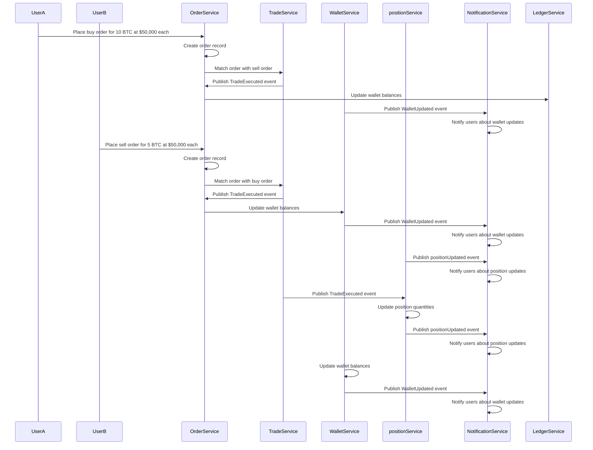

# Overview

This document outlines the design of a microservices-based, event-driven crypto trading platform. The platform consists of the following services:

- User Service
- Order Service
- Trade Service
- Ledger Service
- position Service
- Notification Service

Each service is responsible for a specific domain and communicates with other services through events and REST APIs.

If you are interested in obtaining a copy of the source code or evaluate the performance or our platform, please reach out to me on LinkedIn.

## Services

### 1. User Service

**Responsibilities:**

- Manage user accounts, authentication, and authorization.
- Provide user-related information to other services.

**Endpoints:**

- `POST /api/users/register`: Register a new user.
- `POST /api/users/login`: Authenticate a user.
- `GET /api/users/profile`: Get user profile.
- `POST /api/users/validate`: Validate a token.
- `POST /api/users/refresh_token`: Refresh an access token.

**Communication:**

- Exposes REST APIs for user management.
- Publishes events like `UserCreated`, `UserUpdated`, and `UserDeleted`.

### 2. Order Service

**Responsibilities:**

- Manage orders, including creation, retrieval, updating, and deletion.
- Validate orders and publish events for order processing.

**Endpoints:**

- `POST /api/orders`: Create a new order.
- `GET /api/orders/{id}`: Retrieve order details.
- `GET /api/orders`: Retrieve all orders.
- `PUT /api/orders/{id}`: Update order details.
- `DELETE /api/orders/{id}`: Cancel an order.

**Communication:**

- Exposes REST APIs for order management.
- Publishes events like `OrderCreated`, `OrderUpdated`, and `OrderCancelled`.
- Consumes events like `TradeExecuted` to update order status.

### 3. Trade Service

**Responsibilities:**

- Execute trades based on orders.
- Match buy and sell orders and publish trade execution events.

**Endpoints:**

- `POST /api/trades`: Execute a trade.
- `GET /api/trades/{id}`: Retrieve trade details.
- `GET /api/trades`: Retrieve all trades.
- `PUT /api/trades/{id}`: Update trade details.
- `DELETE /api/trades/{id}`: Delete a trade.

**Communication:**

- Exposes REST APIs for trade management.
- Consumes events like `OrderCreated` to execute trades.
- Publishes events like `TradeExecuted`.

### 4. Ledger Service

**Responsibilities:**

- Manage user wallets and balances.
- Update wallet balances based on trade executions.

**Endpoints:**

- `POST /api/wallets`: Create a new wallet.
- `GET /api/wallets/{id}`: Retrieve wallet details.
- `GET /api/wallets`: Retrieve all wallets.
- `PUT /api/wallets/{id}`: Update wallet balance.
- `DELETE /api/wallets/{id}`: Delete a wallet.
- `POST /api/wallets/{id}/debit`: Debit a wallet.
- `POST /api/wallets/{id}/credit`: Credit a wallet.

**Communication:**

- Exposes REST APIs for wallet management.
- Consumes events like `TradeExecuted` to update wallet balances.
- Publishes events like `WalletUpdated`.

### 5. Notification Service

**Responsibilities:**

- Send notifications to users about their trades, orders, and wallet updates.

**Endpoints:**

- `POST /api/notifications`: Send a notification.
- `GET /api/notifications/{id}`: Retrieve notification details.
- `GET /api/notifications`: Retrieve all notifications.

**Communication:**

- Exposes REST APIs for notification management.
- Consumes events like `OrderCreated`, `TradeExecuted`, and `WalletUpdated` to send notifications.

### 6. position Service (New)

**Responsibilities:**

- Manage positions and track the quantity of positions a user owns.

**Endpoints:**

- `POST /api/positions`: Create a new position.
- `GET /api/positions/{id}`: Retrieve position details.
- `GET /api/positions`: Retrieve all positions.
- `PUT /api/positions/{id}`: Update position details.
- `DELETE /api/positions/{id}`: Delete a position.
- `GET /api/positions/user/{userId}`: Retrieve positions owned by a user.

**Communication:**

- Exposes REST APIs for position management.
- Consumes events like `TradeExecuted` to update position quantities.
- Publishes events like `positionUpdated`.

Sure, let's define the data classes for all the events in your `README.md` file. Here's how you might define them in Kotlin:

## Event Data Classes

In Kotlin, we define the events as data classes. Here are the data classes for all the events:

```kotlin
// User Events
data class UserCreatedEvent(val userId: String, val userName: String)
data class UserUpdatedEvent(val userId: String, val userName: String)
data class UserDeletedEvent(val userId: String)

// Order Events
data class OrderCreatedEvent(val orderId: String, val userId: String, val product: String, val quantity: BigDecimal, val price: BigDecimal, val status: String, val condition: String, val type: String)
data class OrderUpdatedEvent(val orderId: String, val userId: String, val product: String, val quantity: BigDecimal, val price: BigDecimal, val status: String, val condition: String, val type: String)
data class OrderCancelledEvent(val orderId: String, val userId: String)

// Trade Events
data class TradeExecutedEvent(val tradeId: String, val buyOrderId: String, val sellOrderId: String, val product: String, val quantity: BigDecimal, var tradeDate: LocalDateTime, val price: BigDecimal)

// Wallet Events
data class WalletUpdatedEvent(val walletId: String, val userId: String, val balance: BigDecimal)

// position Events
data class positionUpdatedEvent(val positionId: String, val userId: String, val product: String, val quantity: Int)
```

## Event-Driven Communication

The services communicate with each other using an event-driven architecture. The following events are used:

**User Events:**

- `UserCreated`
- `UserUpdated`
- `UserDeleted`

**Order Events:**

- `OrderCreated`
- `OrderUpdated`
- `OrderCancelled`

**Trade Events:**

- `TradeExecuted`

**Wallet Events:**

- `WalletUpdated`

**position Events:**

- `positionUpdated`

## Data Flow Diagram



## Detailed Flows

### 1. Order Placement Flow

**User places an order:**

1. The user sends a request to the Order Service to place an order.
2. The Order Service validates the order and checks the user's balance by querying the Ledger Service.

**Check user balance:**

1. The Order Service sends a request to the Ledger Service to check if the user has sufficient balance.
2. If the user has sufficient balance, the Order Service proceeds to create the order.
3. If the user does not have sufficient balance, the Order Service returns an error response.

**Create order:**

1. The Order Service creates the order and publishes an `OrderCreated` event.

**Order processing:**

1. The Trade Service consumes the `OrderCreated` event and attempts to match the order.
2. If the order is matched fully or partially, the Trade Service publishes a `TradeExecuted` event.

### 2. Trade Execution Flow

**Order matching:**

1. The Trade Service consumes the `OrderCreated` event and attempts to match the order with existing orders.
2. If a match is found, the Trade Service executes the trade and publishes a `TradeExecuted` event.

**Update wallet balance:**

1. The Ledger Service consumes the `TradeExecuted` event and updates the user's wallet balance.
2. The Ledger Service publishes a `WalletUpdated` event.

**Update position quantities:**

1. The position Service consumes the `TradeExecuted` event and updates the quantities of positions owned by the user.
2. The position Service publishes a `positionUpdated` event.

**Send notifications:**

1. The Notification Service consumes the `TradeExecuted` and `WalletUpdated` events to notify the user about the trade execution and wallet balance update.

## Correlation Between Orders and Trades

**Order Creation:**

1. When a user places an order, the Order Service creates an order record with details such as the user ID, order type (buy/sell), symbol, quantity, price, and status.
2. The Order Service publishes an `OrderCreated` event with the order details.

**Order Matching:**

1. The Trade Service consumes the `OrderCreated` event and attempts to match the order with existing orders in the order book.
2. If a match is found, the Trade Service creates a trade record with details such as the trade ID, buy order ID, sell order ID, symbol, quantity, price, and status.
3. The Trade Service publishes a `TradeExecuted` event with the trade details.

**Updating Wallets:**
**Publish WalletUpdated event:**
### Example Flows

#### Example Flow 1: User Registration and Order Placement

1. **User Registration:**
    - The user sends a `POST /api/users` request to the User Service to create a new account.
    - The User Service creates the user and publishes a `UserCreated` event.

2. **Order Placement:**
    - The user sends a `POST /api/orders` request to the Order Service to place a new order.
    - The Order Service validates the order and checks the user's balance by querying the Ledger Service.
    - If the balance is sufficient, the Order Service creates the order and publishes an `OrderCreated` event.

3. **Order Processing:**
    - The Trade Service consumes the `OrderCreated` event and attempts to match the order.
    - If a match is found, the Trade Service executes the trade and publishes a `TradeExecuted` event.

4. **Wallet Update:**
    - The Ledger Service consumes the `TradeExecuted` event and updates the user's wallet balance.
    - The Ledger Service publishes a `WalletUpdated` event.

5. **Notification:**
    - The Notification Service consumes the `OrderCreated`, `TradeExecuted`, and `WalletUpdated` events to notify the user about the order status, trade execution, and wallet balance update.

#### Example Flow 2: position Management

1. **position Creation:**
    - An admin sends a `POST /api/positions` request to the position Service to create a new position.
    - The position Service creates the position and publishes a `positionUpdated` event.

2. **position Update:**
    - The admin sends a `PUT /api/positions/{id}` request to update position details.
    - The position Service updates the position and publishes a `positionUpdated` event.

3. **position Deletion:**
    - The admin sends a `DELETE /api/positions/{id}` request to delete a position.
    - The position Service deletes the position and publishes a `positionUpdated` event.

4. **position Quantity Update:**
    - The position Service consumes the `TradeExecuted` event to update the quantities of positions owned by the user.
    - The position Service publishes a `positionUpdated` event.

5. **Notification:**
    - The Notification Service consumes the `positionUpdated` event to notify users about position updates.


6. After updating the wallet balances, the Ledger Service publishes a `WalletUpdated` event.

7. This event contains details about the updated wallet balances, including the user ID and the new balance.

#### Example Flow 3:

#### 1. Order Creation

- User A places a buy order for 10 BTC at $50,000 each.
- The Order Service creates an order record:
  ```json
  {
    "orderId": "order123",
    "userId": "userA",
    "type": "buy",
    "symbol": "BTC",
    "quantity": 10,
    "price": 50000,
    "status": "pending"
  }

#### 2. Order Matching

- User B places a sell order for 5 BTC at $50,000 each.

- The Order Service creates an order record:
  ```json
  {
  "orderId": "order456",
  "userId": "userB",
  "type": "sell",
  "symbol": "BTC",
  "quantity": 5,
  "price": 50000,
  "status": "pending"
  }

- The Order Service publishes an OrderCreated event:
  ```json
  {
  "orderId": "order456",
  "userId": "userB",
  "type": "sell",
  "symbol": "BTC",
  "quantity": 5,
  "price": 50000
  }

- The Trade Service consumes the OrderCreated events and matches the buy order from User A with the sell order from User B.
- The Trade Service creates a trade record:
  ```json
  {
  "tradeId": "trade789",
  "buyOrderId": "order123",
  "sellOrderId": "order456",
  "symbol": "BTC",
  "quantity": 5,
  "price": 50000,
  "status": "executed"
  }

- The Trade Service publishes a TradeExecuted event:
  ```json
  {
  "tradeId": "trade789",
  "buyOrderId": "order123",
  "sellOrderId": "order456",
  "symbol": "BTC",
  "quantity": 5,
  "price": 50000
  }

#### 3. Updating Wallets

- The Ledger Service consumes the TradeExecuted event and updates the wallets of User A and User B.
- User A's Wallet:
- User A's wallet balance is decreased by the total cost of the trade (5 BTC * $50,000 = $250,000).
- User A's wallet balance is updated
  ```json
  {
    "userId": "userA",
    "balance": {
        "USD": previous_balance - 250000,
        "BTC": previous_balance + 5
    }
  }
- User B's Wallet:
  - User B's wallet balance is increased by the total cost of the trade (5 BTC * $50,000 = $250,000).
  - User B's wallet balance is updated:
    ```json
    {
      "userId": "userB",
      "balance": {
          "USD": previous_balance + 250000,
          "BTC": previous_balance - 5
      }
    }
    ```

- The Ledger Service publishes WalletUpdated events for both users:
  ```json
  {
    "userId": "userA",
    "balance": {
        "USD": updated_balance,
        "BTC": updated_balance
    }
  }
  ```
  ```json
  {
  "userId": "userB",
  "balance": {
        "USD": updated_balance,
        "BTC": updated_balance
    }
  }
  ```
**Notify user:**

1. The Notification Service consumes the `WalletUpdated` event.
2. It sends a notification to the user about the updated wallet balance.

## Conclusion

This document provides a detailed overview of the microservices-based, event-driven architecture for a crypto trading platform. Each service is designed to handle specific responsibilities and communicate with other services through well-defined events and REST APIs. This architecture ensures scalability, maintainability, and flexibility in handling various aspects of the trading platform.
